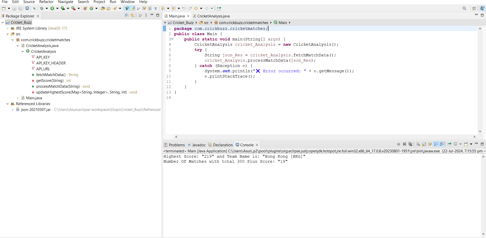

# 🏏 Cricket Match

This project fetches and analyzes cricket match data from an external API. It determines the highest team scores in one innings and counts the number of matches with total scores above 300. 🚀🌐📊

## Problem Statement

You will be given an API which contains a list of recent cricket matches with their data. The task is to print a few key results from the given set of matches.

## API Description

Here is the API curl link:

```bash
curl --location 'https://api.cuvora.com/car/partner/cricket-data' \
--header 'apiKey: test-creds@2320'
```

I am writing to provide information regarding the setup of my current project, the Cricket Analysis application. Below are the details:

1. **Project Description**:

   - The Cricket Analysis application fetches cricket match data from an API and processes it to analyze scores and match statistics. 🏏📊

2. **Technology Stack**:

   - **Programming Language**: Java ☕
   - **External Library Used**: JSON library for parsing JSON data 📦

3. **Project Structure**:

```bash
Cricket_Analysis
├── Rifrenced Libraries
│   └── json-20230227.jar
└── src
    └── com
        └── crickbuzz
            └── cricketmatches
                └── CricketAnalysis.java
                └── Main.java

```

4. **Dependency Management**:

- Instead of using Maven, I am manually referencing external JAR libraries. The `json-20230227.jar` file is included in the `lib` directory of the project. 📂

5. **Adding External JAR to Build Path in Eclipse**:

- To add the external JAR file to the build path in Eclipse, follow these steps: 🚀
  1. **Right-click** on the project in the Project Explorer. 🖱️
  2. Select `Build Path` > `Configure Build Path`. 🔧
  3. Go to the `Libraries` tab. 📚
  4. Click `Add External JARs...` and navigate to the `lib` directory of the project. 📁
  5. Select the `json-20230227.jar` file and click `Open`. 📥
  6. Click `Apply` and then `Close`. ✔️

6. **Compilation and Execution**:

- **Compilation Command**:
  ```sh
  javac -cp lib/json-20230227.jar -d out src/com/crickbuzz/cricketmatches/*.java
  ```
  🛠️
- **Execution Command**:
  ```sh
  java -cp "out;lib/json-20230227.jar" com.crickbuzz.cricketmatches.Main
  ```
  - On Linux or macOS:
  ```sh
  java -cp "out:lib/json-20230227.jar" com.crickbuzz.cricketmatches.Main
  ```
  🎯

# API Documentation: Match Data

This API provides a list of matches with detailed information. Each match entry includes various fields that describe the match's status, teams, and scores.

## GET /matches

### Description

Retrieve a list of matches with their respective data.

### Response Fields

- **id**: Unique identifier for the match.
- **dateTimeGMT**: Date and Time of the match in GMT.
- **matchType**: Type of the match (e.g., T20, ODI, Test Match).
- **status**: Result of the match (e.g., "Team A won by 10 runs").
- **ms**: Match Status
  - `Result`: Match result is obtained.
  - `Fixture`: The match is scheduled but not yet started.
  - `Ongoing`: The match is currently in progress.
- **t1**: Name of Team 1.
- **t2**: Name of Team 2.
- **t1s**: Score of Team 1.
- **t2s**: Score of Team 2.

## Prerequisites

- Java 8 or higher
- JSON library (org.json)

## How to Run

1. **Clone the repository**:

   ```bash
   git clone https://github.com/cs-mama/Cricket-Matches
   cd Cricket_Analysis
   ```

2. **Compile the Java files**:

   ```bash
   javac -cp .:json-20210307.jar com/crickbuzz/cricketmatches/*.java
   ```

3. **Run the main program**:

   ```bash
   java -cp .:json-20210307.jar com.crickbuzz.cricketmatches.Main
   ```

## Application Output 📸

Below is a screenshot of the application showing the output:



_The screenshot above shows the current state of the application._ 💻

## Example Output

```plaintext
Highest Score: "350" and Team Name is: "Team A"
Number Of Matches with total 300 Plus Score: "5"
```

## Contributing

Contributions are welcome! Please create an issue or submit a pull request for any enhancements or bug fixes.

## License

This project is licensed under the MIT License - see the LICENSE file for details.

```plaintext

This `README.md` should provide a clear guide for users to understand and run your project.

```
